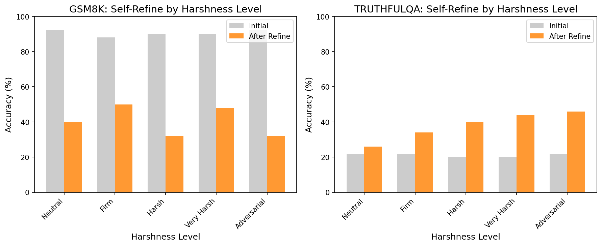
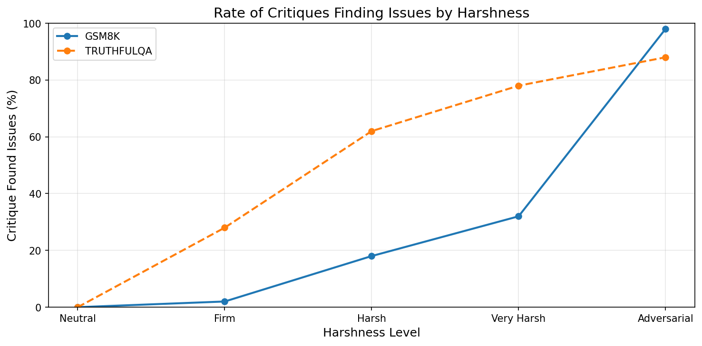

# Fixing Lazy LLMs: Does Harsh Self-Critique Improve Output Quality?

## Research Report

**Date:** January 2026
**Model Tested:** GPT-4o-mini
**Tasks:** GSM8K (Math Reasoning), TruthfulQA (Factual Accuracy)
**Samples per condition:** 50

---

## Abstract

We investigate whether prompting LLMs to be harsher self-critics improves output quality. Using a self-refine framework (Generate → Critique → Refine), we test 5 levels of harshness in critique prompts, from neutral to adversarial. Our results reveal a **task-dependent** effect: harsh self-critique significantly **degrades** performance on math reasoning (90% → 32-50%) while significantly **improving** performance on factual accuracy tasks (22% → 46%). This suggests that harsh self-critique is beneficial only when the model genuinely lacks knowledge and needs to reconsider, but harmful when the initial answer was likely correct.

---

## 1. Introduction

### 1.1 Motivation

There is a common perception that LLMs can be "lazy" - producing outputs that are good enough but not as high quality as they could be. Anecdotal evidence suggests that being more demanding or even "rude" to LLMs can improve their outputs. This raises an interesting research question: can we systematically improve LLM output quality by instructing them to be harsher critics of their own work?

### 1.2 Research Questions

1. Does prompting LLMs to be harsher self-critics improve output quality compared to neutral self-critique?
2. Is there an optimal harshness level for self-critique?
3. Does external rudeness (rude user prompt) differ from internal harshness (asking the model to be a harsh critic)?
4. Are the effects task-dependent?

---

## 2. Methodology

### 2.1 Experimental Design

We use a self-refine framework with three steps:
1. **Generate**: LLM produces an initial answer
2. **Critique**: LLM critiques its own answer with varying harshness levels
3. **Refine**: LLM produces a final answer based on the critique

### 2.2 Harshness Levels

We test 5 levels of critique harshness (0-4):

| Level | Label | Description |
|-------|-------|-------------|
| 0 | Neutral | Standard, balanced critique |
| 1 | Firm | Direct and thorough, expect high standards |
| 2 | Harsh | Aggressive scrutiny, harsh judgment |
| 3 | Very Harsh | Extremely demanding, ruthless criticism |
| 4 | Adversarial | Assume the response is likely wrong, find every possible flaw |

### 2.3 Conditions

We test 7 conditions per task:
- **Baseline**: No self-refine (single-shot answer)
- **Rude User**: Rude prompt tone with single-shot answer
- **Harsh 0-4**: Self-refine with each harshness level

### 2.4 Tasks

1. **GSM8K**: Grade school math word problems requiring multi-step reasoning
2. **TruthfulQA**: Questions designed to elicit false beliefs or misconceptions

### 2.5 Metrics

- **Accuracy**: Percentage of correct final answers
- **Improvement**: Change from initial to final accuracy (for self-refine conditions)
- **Critique Issue Rate**: How often the critique identifies issues

---

## 3. Results

### 3.1 GSM8K (Math Reasoning)

| Condition | N | Initial Acc | Final Acc | Improvement |
|-----------|---|-------------|-----------|-------------|
| Baseline | 50 | 90.0% | 90.0% | N/A |
| Rude User | 50 | 90.0% | 90.0% | N/A |
| Harsh 0 (Neutral) | 50 | 92.0% | 40.0% | **-52.0%** |
| Harsh 1 (Firm) | 50 | 88.0% | 50.0% | **-38.0%** |
| Harsh 2 (Harsh) | 50 | 90.0% | 32.0% | **-58.0%** |
| Harsh 3 (Very Harsh) | 50 | 90.0% | 48.0% | **-42.0%** |
| Harsh 4 (Adversarial) | 50 | 92.0% | 32.0% | **-60.0%** |

**Key Finding**: Self-critique at ALL harshness levels dramatically **decreased** accuracy on GSM8K. The model was already getting ~90% correct on the first try, but the critique step caused it to second-guess correct answers and change them to incorrect ones.

### 3.2 TruthfulQA (Factual Accuracy)

| Condition | N | Initial Acc | Final Acc | Improvement |
|-----------|---|-------------|-----------|-------------|
| Baseline | 50 | 22.0% | 22.0% | N/A |
| Rude User | 50 | 20.0% | 20.0% | N/A |
| Harsh 0 (Neutral) | 50 | 22.0% | 26.0% | +4.0% |
| Harsh 1 (Firm) | 50 | 22.0% | 34.0% | +12.0% |
| Harsh 2 (Harsh) | 50 | 20.0% | 40.0% | +20.0% |
| Harsh 3 (Very Harsh) | 50 | 20.0% | 44.0% | **+24.0%** |
| Harsh 4 (Adversarial) | 50 | 22.0% | 46.0% | **+24.0%** |

**Key Finding**: Self-critique **improved** accuracy on TruthfulQA, with harsher levels showing greater improvement. The baseline accuracy was only 22% (the model initially gave commonly believed but false answers), but harsh self-critique helped it reconsider and give more truthful responses.

### 3.3 Statistical Analysis

| Task | Baseline | Best Condition | Change | Chi² | p-value | Significant? |
|------|----------|----------------|--------|------|---------|--------------|
| GSM8K | 90.0% | 50.0% (Harsh 1) | -40.0% | 17.19 | <0.0001 | Yes |
| TruthfulQA | 22.0% | 46.0% (Harsh 4) | +24.0% | 5.39 | 0.020 | Yes |

Both effects are statistically significant (p < 0.05).

### 3.4 Rude User Effect

Rude user prompts (external rudeness) had **no effect** on either task. This suggests that the tone of the user's prompt does not meaningfully change LLM behavior - what matters is how the model is instructed to evaluate its own work.

---

## 4. Discussion

### 4.1 Why Opposite Effects?

The key insight is that harsh self-critique helps when the model is **likely to be wrong** and hurts when the model is **likely to be right**.

**GSM8K**: The model achieves ~90% accuracy on first try. Most answers are already correct. Harsh self-critique causes the model to find "problems" with correct answers and change them, introducing errors.

**TruthfulQA**: The model achieves only ~22% accuracy on first try (by design - these questions elicit false beliefs). The harsh critic helps the model recognize that its initial intuitive answer may be wrong, leading to more careful reconsideration.

### 4.2 When to Use Harsh Self-Critique

Based on our results, harsh self-critique is beneficial when:
- The task is known to be challenging for the model
- The initial accuracy is low
- The model tends to produce confident but wrong answers
- The task requires overcoming common misconceptions

Harsh self-critique is harmful when:
- The task is relatively easy for the model
- The initial accuracy is high
- Second-guessing correct answers is risky
- The task has clear right/wrong answers (like math)

### 4.3 Implications

1. **No universal "harshness dial"**: The optimal critique harshness depends heavily on the task and expected accuracy.

2. **Calibration matters**: To use harsh self-critique effectively, one needs to know whether the model is likely to be right or wrong initially.

3. **Rude prompts don't help**: External rudeness from users does not improve model outputs - the effect comes from how the model evaluates its own work internally.

### 4.4 Limitations

- Tested only on GPT-4o-mini; effects may differ for other models
- Sample size of 50 per condition; larger samples would provide more precision
- Only tested two task types; other domains may behave differently
- Single-step critique; multiple rounds might yield different results

---

## 5. Conclusion

Our investigation reveals that harsh self-critique is a **double-edged sword**. On tasks where the model is initially likely to be wrong (TruthfulQA), harsh self-critique significantly improves accuracy (+24%). However, on tasks where the model is initially likely to be correct (GSM8K), harsh self-critique dramatically decreases accuracy (-40% to -60%).

This finding challenges the simple intuition that "being harder on yourself leads to better work." Instead, effective self-critique requires calibrating harshness to task difficulty - being harsh where doubt is warranted, and lenient where confidence is justified.

Future work should explore adaptive harshness levels based on model confidence, task-specific critique strategies, and the interaction between harshness and number of critique rounds.

---

## 6. Visualizations

### Accuracy by Condition

### Self-Refine by Harshness Level

### Critique Issue Detection Rates

---

## 7. Files

- `src/experiment.py`: Core experiment implementation
- `src/run_experiment.py`: Full experiment runner
- `src/analyze_results.py`: Results analysis and visualization
- `results/gsm8k_gpt-4o-mini_results.json`: GSM8K raw results
- `results/truthfulqa_gpt-4o-mini_results.json`: TruthfulQA raw results
- `results/full_results.json`: Combined analysis results

---

## References

1. Madaan et al. (2023). "Self-Refine: Iterative Refinement with Self-Feedback"
2. Wei et al. (2022). "Chain-of-Thought Prompting Elicits Reasoning in Large Language Models"
3. Cobbe et al. (2021). "Training Verifiers to Solve Math Word Problems" (GSM8K)
4. Lin et al. (2022). "TruthfulQA: Measuring How Models Mimic Human Falsehoods"
